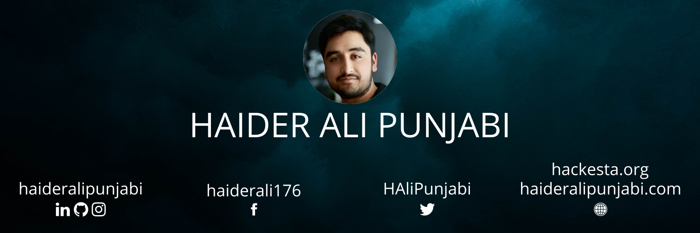

# Haider Ali Punjabi

Python | HTML | JS

  <i>Let's connect and chat! Find me on the web...</i>
  
    
    
    
   
    
     

<h2> 𝐇𝐞𝐥𝐥𝐨 𝐭𝐡𝐞𝐫𝐞, 𝐟𝐞𝐥𝐥𝐨𝐰 <𝚌𝚘𝚍𝚎𝚛𝚜/>! </h2>

* Primary coding language: Python & JS.
* I’m currently working on [CovidKashmir](https://covidkashmir.org)
* I make web apps about stuff I am interested in.
* Ask me about anything, I'll be happy to help.
* From Kashmir

### My Digital Garden 🌱
I write regular blog posts which you will find on [my blog](https://blog.haideralipunjabi.com), [dev.to](https://dev.to/haideralipunjabi) & [Medium](https://medium.com/@haideralipunjabi).
- [Redesigning My Website - Automation, Custom SSG & Optimisations](https://blog.haideralipunjabi.com/posts/redesigning-my-website-automation-custom-ssg-optimisations/)
- [Automating Android Games with Python & Pytesseract: Sudoku](https://blog.haideralipunjabi.com/posts/automating-android-game-with-python-pytesseract-sudoku/)
- [Harry Potter Books & Fanfiction - An Analysis of Words](https://blog.haideralipunjabi.com/posts/harry-potter-books-fanfiction-an-analysis-of-words/)
- [Adding View Count to your JAMstack Website with JavaScript and Google Analytics](https://blog.haideralipunjabi.com/posts/adding-view-count-to-your-jamstack-website/)

 

<h3 align="center">Show some &nbsp;❤️&nbsp; by starring some of the repositories!</h3>
